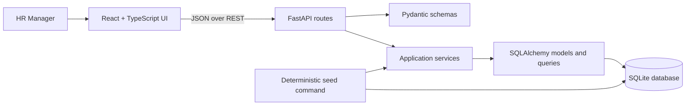

# Salary Management — Application Architecture

## 1. Architecture Overview

Build a small, single-deployment web application with a React/TypeScript frontend, a FastAPI backend, and a SQLite database. The frontend communicates with the backend only through a JSON REST API. The backend owns validation, salary rules, database queries, and analytics; the browser owns presentation and interaction state.

The backend is organized into HTTP routes, request/response schemas, application services, and SQLAlchemy persistence/query code. Business rules such as salary validation and currency precision remain callable without an HTTP request. SQLite is appropriate for this single-instance assessment application and the approximately 10,000 seeded employees; it does not require a separate database service.

The first version stores each employee's current salary only. There is no payroll processing, salary history, authentication, approval workflow, or AI product feature.

## 2. Technology Choices

| Area | Choice | Reason |
| --- | --- | --- |
| Backend | Python, FastAPI | Typed request handling, automatic OpenAPI documentation, and a direct fit for the assessment. |
| Persistence | SQLAlchemy | Relational mapping and composable, parameterized queries; keeps persistence separate from HTTP handlers. |
| API schemas | Pydantic | Request validation and explicit response contracts. |
| Database | SQLite | Relational constraints and transactions without operational infrastructure; sufficient for this application's stated scale and deployment shape. |
| Tests | pytest | Fast, focused unit and API/database integration tests. |
| Frontend | React, TypeScript, Vite | A compact, typed single-page application with a quick local development loop and static production build. |
| UI | MUI | Accessible, maintained table, form, and dialog components suited to a data-heavy HR tool. |
| Charts | Recharts, where useful | Simple charts for grouped compensation ranges; tables remain the primary precise representation. |

## 3. High-Level Components



The browser does not connect to SQLite. Routes translate HTTP inputs and outputs; services enforce use-case rules; query functions perform filtering, pagination, sorting, and aggregation in the database. The seed command reuses the persistence layer and can be run separately from serving HTTP traffic.

## 4. Backend Project Structure

```text
backend/
  app/
    main.py                 # FastAPI application and router registration
    api/
      routes/
        employees.py        # Directory, employee detail, salary update
        analytics.py        # Compensation insights
      dependencies.py       # SQLAlchemy session dependency
    schemas/
      employees.py          # Employee and salary request/response models
      analytics.py          # Analytics response models
    services/
      employees.py          # Employee and salary use cases
      analytics.py          # Analytics orchestration and currency rules
    db/
      session.py            # Engine, session factory, session lifecycle
      models.py             # SQLAlchemy entities
      queries.py            # Reusable SQLAlchemy filters and aggregates
    seed.py                 # Deterministic seed command
  tests/
    unit/
    integration/
```

Keep this as a lightweight module structure, not a framework within the framework. FastAPI dependency injection supplies a request-scoped database session to route/service calls and guarantees it is closed after the request. Services should accept explicit inputs and persistence collaborators so their validation and rules can be tested without constructing HTTP requests.

## 5. Frontend Project Structure

```text
frontend/
  src/
    app/                    # App shell and route/view composition
    api/                    # Typed REST client and response types
    features/
      employees/            # Directory, filters, detail, salary editor
      analytics/            # Summary, grouped metrics, distribution
    components/             # Shared table, form, loading and error UI
    main.tsx
```

Use feature-local components and API calls; avoid a general state-management layer until shared state warrants it. Keep query parameters for directory filters and pagination in the URL where practical so a filtered view can be refreshed or shared. The UI must show currency alongside every salary and every salary statistic/range.

## 6. Core Domain / Entity Model

The minimum entity is `Employee`, representing one current employee record and current annual salary:

| Field | Meaning |
| --- | --- |
| `employee_id` | Stable employee identifier supplied by the dataset; primary key. |
| `name` | Employee's display name; searchable. |
| `country` | Country code or normalized country name used for filtering and counts. |
| `department` | Department label used for filtering and counts. |
| `salary_minor_units` | Non-negative integer amount in the minor unit of `currency` (for example, cents where the currency has two decimal places). |
| `currency` | Three-letter ISO 4217 currency code for the employee's local salary. |
| `updated_at` | UTC timestamp for the last salary update; initialized at seed time. |

Salary update requests supply a major-unit decimal amount and currency context is read from the employee. The service validates the amount against a small currency-to-minor-unit precision map, then converts it exactly to the stored integer. Currency is not changed by the salary-update operation. This model intentionally omits job titles, addresses, managers, employment status, salary history, and other fields not required by the product.

## 7. Database Schema and Relationships

One table is sufficient for the initial scope; there are no required one-to-many relationships.

```text
employee
  employee_id          TEXT PRIMARY KEY
  name                 TEXT NOT NULL
  country              TEXT NOT NULL
  department           TEXT NOT NULL
  salary_minor_units   INTEGER NOT NULL CHECK (salary_minor_units >= 0)
  currency             TEXT NOT NULL CHECK (length(currency) = 3)
  updated_at           DATETIME NOT NULL
```

Add indexes for `country`, `department`, and `(currency, salary_minor_units)` to support common filters, counts, and within-currency salary ordering. Employee ID is indexed by its primary-key constraint. A name index may help prefix search; substring matching may not use a conventional index, which is acceptable for the fixed initial dataset size. Add or adjust indexes only in response to measured query plans. Country, department, and currency values should be normalized consistently by the seed and validated update/query boundaries; separate lookup tables are not needed for this version.

SQLite stores the salary as an integer, so database sorting, minimum/maximum, and sums do not introduce floating-point money errors. Currency precision determines conversion between API decimal amounts and minor units; reject values with excess fractional digits rather than silently rounding.

## 8. API Contract Proposal

Prefix endpoints with `/api`. JSON responses use explicit schemas; salary amounts are serialized as decimal strings to preserve exact values, with a separate ISO currency code.

### `GET /api/employees`

Returns a page of employees. Query parameters:

| Parameter | Behavior |
| --- | --- |
| `page` | 1-based page, default `1`. |
| `page_size` | Default `25`, capped at `100`. |
| `search` | Optional match against employee ID or name. |
| `country`, `department` | Optional exact-match filters. |
| `currency` | Optional currency filter, useful for a currency-scoped salary view. |
| `sort_by`, `sort_order` | Whitelisted employee attributes and `asc`/`desc`; default to employee ID ascending. |

Response includes `items`, `total`, `page`, and `page_size`. Each item contains employee ID, name, country, department, salary amount, currency, and `updated_at`.

Sorting by salary requires an explicit `currency` filter. Otherwise, comparing numeric salary amounts across currencies would imply a comparison that the system cannot support. Every sort also uses `employee_id` as a stable tie-breaker.

### `GET /api/employees/{employee_id}`

Returns one employee with the same fields as a directory item, or `404` when the identifier does not exist.

### `PATCH /api/employees/{employee_id}/salary`

Updates the employee's current annual salary and `updated_at` timestamp. Request body: `{ "salary_amount": "85000.00" }`. Currency remains the employee's stored local currency and is returned in the response. Reject negative values, malformed decimals, excess currency precision, and amounts outside the supported storage range. Return the updated employee or `404` if absent.

### `GET /api/analytics/compensation`

Accepts optional `country`, `department`, and `currency` filters so summary insights can match or further narrow the directory cohort. Return:

* Employee count for the filtered cohort.
* Employee counts grouped by country and by department within that cohort.
* Salary metrics grouped by currency: employee count, average, median, minimum, maximum, and salary-range buckets.

Each salary metric and bucket includes its currency code. There is intentionally no all-currency average, median, minimum, maximum, or distribution. Without a currency filter, salary metrics are returned as separate groups for each currency in the filtered cohort. With a currency filter, the metrics are restricted to that currency.

These endpoints cover the stated workflows; no generic employee CRUD, separate currency endpoint, or salary-history endpoint is needed.

## 9. Pagination, Search, Filtering, and Sorting

Apply all filters in SQL before counting and fetching a page. Use `LIMIT`/`OFFSET` (or SQLAlchemy's equivalent) for database-side pagination, not browser-side slicing. Return the total matching count separately from the page rows. Cap page size to bound response size and use stable ordering with employee ID as a final tie-breaker.

Search checks employee ID and name. Employee ID can match exactly or by prefix; name can use case-insensitive substring matching for convenient HR lookup. Bind search values as parameters. For 10,000 rows, a straightforward `LIKE` query is adequate; do not add a search engine or FTS subsystem without evidence that it is needed.

Country, department, and currency filters are exact matches. Sorting is selected from a fixed allowlist of employee ID, name, country, department, salary, and update time; never interpolate user-supplied SQL identifiers. Salary sort requires an explicit currency filter. The selected filter and sort state should persist when moving between pages.

## 10. Analytics and Query Approach

Use filtered SQL queries for cohort counts, country/department counts, and per-currency salary aggregates. Group every salary calculation by currency after applying the same optional country and department filters. Do not combine minor-unit values from different currencies, even if their numeric magnitudes happen to match.

Compute average from grouped integer sum and count, converting the result to a decimal major-unit value for the response. Compute minimum and maximum from grouped database aggregates. SQLite does not provide a portable built-in median aggregate; for each currency group, calculate the middle one or two ordered salary values with indexed `ORDER BY` plus `LIMIT`/`OFFSET`, then compute the median from those values. This reads at most two salary values per currency rather than loading the employee cohort into application memory.

Provide salary distribution as ranges within each currency group. A practical first implementation derives a small set of ranges from that group's minimum and maximum, then asks SQL for counts within those boundaries; a group whose values are all equal is represented by one range. Return explicit lower/upper bounds and counts for each bucket. Country and department headcounts are safe to aggregate across currencies because they count employees rather than add salary amounts.

Every dashboard query uses the same cohort filters. The interface labels the selected filters and currency group so a displayed metric cannot be mistaken for a global, normalized compensation figure. No FX conversion or implied cross-currency salary ranking is performed.

## 11. Validation and Error Handling

Validate query parameters and request bodies at the Pydantic/API boundary, and enforce domain-specific constraints again in the service before persistence. Salary amounts must be finite decimal values, non-negative, within storage limits, and representable at the employee currency's supported minor-unit precision. Currency is stored as an ISO code and is not accepted as an arbitrary salary-update override.

Use consistent HTTP semantics: `422` for invalid parameters or salary input, `404` for an unknown employee, and normal `200` responses for successful reads and updates. Return a stable error shape with a human-readable message and field details where relevant; do not expose SQL, stack traces, or internal paths. Handle unexpected errors through FastAPI's standard exception handling and log diagnostic details server-side. Database updates occur in a transaction; commit on success and roll back on failure. Updating the amount and timestamp is one atomic operation.

## 12. Testing Strategy

Use deterministic, fast pytest coverage across three focused levels:

* Unit tests for salary parsing, currency precision conversion, negative and out-of-range rejection, median and range-bucket edge cases, and service behavior independent of HTTP.
* API/database integration tests using a temporary SQLite database and FastAPI's dependency override for session injection. Cover list filters, search, pagination totals, sort allowlisting and salary-sort currency requirement, employee detail/`404`, valid and invalid salary updates, and analytics results.
* Seed tests that verify repeatable employee IDs/attributes, target row count, valid currencies/amounts, and idempotent behavior.

Include analytics tests with at least two currencies and deliberately different numeric salary values; assert separate salary groups and no combined salary summary. Include median cases with odd/even counts, equal salaries, and filtered cohorts. Keep test fixtures small except for one seed-size check, and avoid network calls or nondeterministic timestamps in expected values. Run backend tests and frontend type/build checks as part of the regular development workflow.

## 13. Seed-Data Strategy

Provide a repeatable backend seed command that inserts approximately 10,000 synthetic employees with stable IDs and values generated from a fixed seed. Use deterministic name, country, department, currency, and salary selection; ensure the country/currency combinations are plausible and include multiple currencies. Initialize `updated_at` to a fixed timestamp for seeded rows so outputs and tests remain repeatable.

Make seeding idempotent: a second run must not duplicate employees. Use a transaction and bulk insert/upsert behavior supported by the chosen SQLAlchemy/SQLite versions. Keep the target count configurable for small local/test datasets while making the assessment default approximately 10,000. Seed data must be clearly synthetic and contain no real employee personal information.

## 14. Deployment Approach

Deploy one FastAPI application that serves the Vite production build from the same origin as its `/api` routes. Serve static assets directly and return the frontend entry point for non-API SPA paths; keep FastAPI's OpenAPI routes available. This avoids cross-origin configuration and requires the frontend bundle to be present in `frontend/dist` at startup.

On Railway, mount a persistent volume at `/data`. When `DATABASE_URL` is unset, configure the application to store SQLite at `$RAILWAY_VOLUME_MOUNT_PATH/salary_management.db`; local development continues to default to `./salary_management.db`. Initialize a fresh database at service startup only when its employee table is empty, using the deterministic seed command. Railway volumes are not available during pre-deploy commands, so this check belongs in the application start command. Preserve the volume across releases and use an SQLite-aware backup method. SQLite remains a single-instance choice; consider a server database only if write concurrency or multi-instance availability requirements outgrow this deployment shape.

## 15. Trade-offs and Rejected Alternatives

* **SQLite instead of a managed server database:** minimizes setup and is sufficient for the stated single-instance scale; concurrent-write and multi-instance limits are accepted for v1.
* **One current salary on `Employee`:** directly supports the requested view/update flow. Full history and audit workflows are explicitly out of scope.
* **Local-currency analytics, not FX normalization:** there is no exchange-rate source or conversion requirement. Salary averages, medians, extrema, sorting, and ranges are grouped by currency; headcounts may be grouped across currencies.
* **One backend and one relational database:** avoids the operational and consistency costs of microservices, queues, Redis, Kafka, Celery, and CQRS for a compact application.
* **REST and server-side SQL queries:** provides a clear frontend/backend boundary and avoids loading the full employee dataset into the browser.
* **No authentication/RBAC in v1:** the requirements assume the HR Manager persona and explicitly exclude authentication/role management.
* **No chatbot or LLM feature:** AI assistance is part of development, not a product requirement; structured search, filters, and analytics answer the stated needs more directly.
* **No separate search engine or chart-first analytics:** SQLite queries are adequate for the dataset, and tables remain the precise source of compensation values.

## Open Implementation Decisions

* Select the exact supported country/currency seed combinations and the small ISO currency precision map.
* Set the initial salary-distribution bucket count and exact boundary/label convention, including rounding for displayed range labels.
* Choose the hosting target and whether the production frontend is served by a static host or alongside FastAPI behind a same-origin proxy.